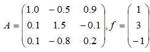

## Лабораторная работа №5. Метод Монте-Карло.

**Задание:**\
Решить систему линейных уравнений, используя метод Монте-Карло.

1) Решить систему линейных алгебраических уравнений   методом Монте-Карло.
2) Сравнить с решением данного уравнения, полученным в произвольном математическом пакете.
3) Построить график зависимости точности решения от длины цепи маркова и числа смоделированных цепей маркова.

